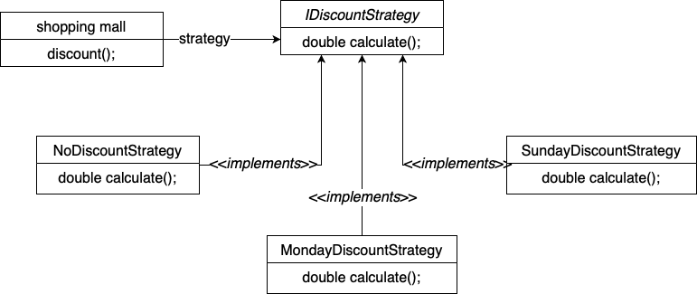

# Shopping Mall using Test Driven Development

* There is a shopping mall which will calculate the bill amount based on the discount coupon.
* Discount coupons will be used only on specific days, we will have percentages according to the days.
* Based on the week day, the shopping mall should give discounts at any point of time.
* Now strategy pattern is used, whenever a shopping mall needs a particular discount during run time.

