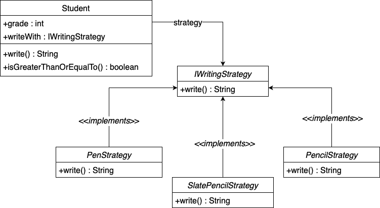

# Strategy pattern examples using Test Driven Development

## Example-1 (ShoppingMall):

* There is a shopping mall which will calculate the bill amount based on the discount coupon.
* Discount coupons will be used only on specific days, we will have percentages according to the days.
* Based on the week day, the shopping mall should give discounts at any point of time.
* Now strategy pattern is used, whenever a shopping mall needs a particular discount during run time.

 

### code: [shopping mall](https://github.com/shaikrasheed99/strategy-pattern/tree/master/src/main/java/com/tw)

 

 

## Example-2 (Student):

* There is a student who is studying a particular grade. 
* If his grade is less than two, then he must write his homework with his slate pencil. 
* If his grade is less than five and greater than two, then he must use a pencil for his homework. 
* If his grade is greater than five, then he is allowed to use a pen for his writings

 

### code: [student](https://github.com/shaikrasheed99/strategy-pattern/tree/master/src/main/java/com/tw)

 

